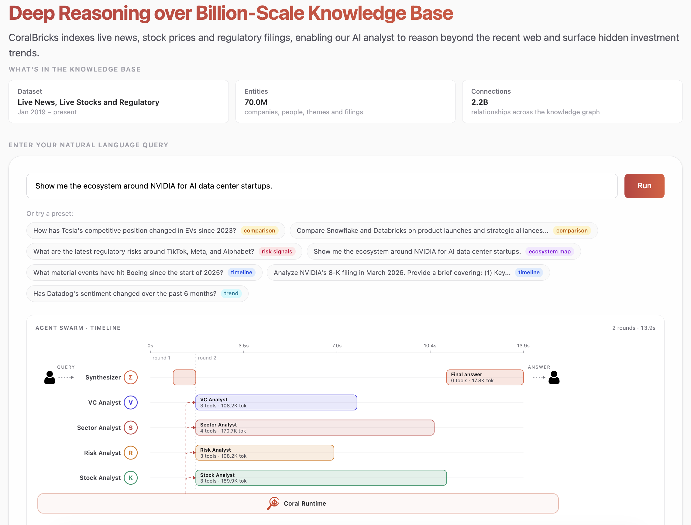
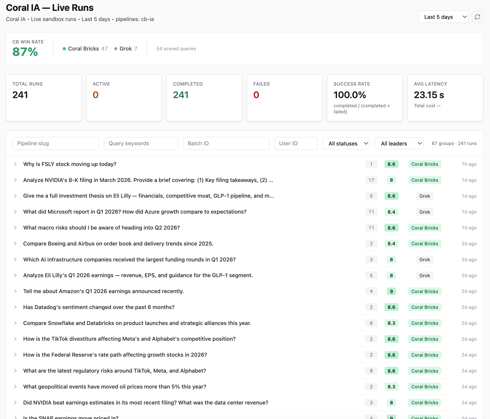

<div align="center">

# AlphaCumen

### State-of-the-art on public financial benchmarks. Lowest cost per query.

**82.6%** on Vals AI Finance Agent v2 &nbsp;·&nbsp; **90%** on Vals AI v1.1 &nbsp;·&nbsp; **89.3%** on FinanceBench &nbsp;·&nbsp; **$0.13** per question

[](../LICENSE)
[](#)
[](https://github.com/Coral-Bricks-AI/coral-ai)
[](https://coralbricks.ai/blog/finance-benchmarks)
[](https://coralbricks.ai/blog/alphacumen-investment-research)


</div>

---

## What this is

**AlphaCumen is a 7-agent finance swarm** orchestrating 69 domain skills across SEC filings, equity bars, news, and options — running on Kimi K2.6.

Swap Vals AI's generic harness for AlphaCumen's finance-specific stack, and the same Kimi K2.6 model **gains 38 points on v2 and 33 points on v1.1**. Frontier models on the generic harness top out in the 44–64% range. AlphaCumen lands at 82.6 / 90 / 89.3.

> **One sentence:** A domain-specific agent harness beats every frontier model on finance benchmarks, at ~10× lower cost — and the code that does it is open.

---

## The headline numbers

| Benchmark | Top frontier (generic harness) | **AlphaCumen** | Gain |
|---|--:|--:|--:|
| Vals AI Finance Agent **v2** (27 questions) | 57.86% (Gemini 3.5 Flash) | **82.6%** | **+24.7pp** |
| Vals AI Finance Agent **v1.1** (50 questions) | 64.4% (Opus 4.7) | **90.0%** | **+25.6pp** |
| Patronus AI **FinanceBench** (150 questions) | — (no live leaderboard) | **89.3%** | — |

All accuracy numbers reported with 95% CIs in the [full write-up](https://coralbricks.ai/blog/finance-benchmarks).

### Cost — API only, per query, on Vals AI v1.1

| Stack | $ / query | vs Opus 4.7 |
|---|--:|--:|
| Opus 4.7 | $1.348 | 1.0× |
| Kimi K2.6 (vanilla) | $0.205 | 6.6× cheaper |
| **Kimi K2.6 on Coral** | **$0.133** | **10.2× cheaper** |

**Best accuracy and lowest cost in the same system.**

---

## How it works — the swarm

When you ask AlphaCumen a question — *"What did Microsoft report in Q1 2026?"* or *"What macro risks should I watch heading into Q2?"* — the planner dispatches **four specialist agents in parallel**:

- **Sector analyst** — searches live SEC filings (10-K, 10-Q, 8-K, 20-F), extracts the actual revenue / EPS / margin figures from filing text
- **Stock analyst** — pulls real-time equity prices, computes technical indicators, analyzes options positioning
- **Competitive-intelligence analyst** — searches news + financial articles for market-share shifts and strategic moves
- **Risk analyst** — scans a global event stream across 190+ countries for geopolitical risk, pulls macro time series (CPI, rates, oil, Treasuries)

Each specialist works independently for 5–10 seconds, then their findings converge into a single synthesized, **fully cited** report. Total time = the slowest specialist, not the sum.

<div align="center">



</div>

Every claim in the final report traces back to a specific source — a filing accession number, a dated news article, or a timestamped macro observation. **No unsourced assertions.**

---

## Live runs — 87% win rate vs Grok

We score every production query against Grok with an automated judge across five dimensions: data accuracy, financial rigor, actionability, completeness, internal consistency.

<div align="center">



</div>

| Metric | Result |
|---|---|
| Win rate vs Grok | **87%** |
| Pipeline success rate | **100%** |
| Avg response time | **23.15s** |

---

## The leaderboards

### Vals AI Finance Agent v2 — newest, hardest

<div align="center">


</div>

Same model (Kimi K2.6) on the generic Vals AI harness scores **44.87%**. On AlphaCumen's harness: **82.6%**. That delta is the domain stack.

### Vals AI Finance Agent v1.1

<div align="center">


</div>

---

## What moved the numbers

<div align="center">


</div>

**1. Finance rules in code, not prose.** Inventory turnover, working capital, basis-point baselines — no single definition analysts agree on. Each rule lives in tested code (~a dozen dedicated computation tools), not in a natural-language prompt the model can paraphrase its way around. The other half is *time*: fiscal-year references resolve to each issuer's own calendar, not the default calendar year.

**2. Multi-filing orchestration.** *"Did the company beat the forecast it gave investors?"* — pull the forecast from one filing and the actual results from a later one, compare line by line. The planner routes this to the specialist that owns the filing-pair tool — one call returns both filings together, so the model can't mismatch quarters. The specialist renders the comparison into a structured form with a row for every line the company originally guided on, so the model can't skip non-headline items (stock-based comp, capex, share count) that often matter more than the headline.

**3. Data coverage.** Expanded ingestion to include proxy statements (board votes, exec comp), prospectuses (new-share details), registration statements (capital raises), foreign-private-issuer monthly revenue reports, and 10-K/A amendments — filing types typical finance datasets under-index. **Per-question asof** was the single biggest lever — making the asof horizon a per-question setting (not a global clamp) let the planner pull post-asof filings when the question explicitly references later quarters.

**4. Retrieval ranking.** Pure keyword search ranks single-cell table answers low because the surrounding narrative repeats the metric name dozens of times. Embeddings don't save you either. The fix: route the query to the section of the filing that actually carries the granular numbers (disclosure notes, not management discussion), then run a structured-table extractor that records each cell as a *(metric, period, value)* triple — so the model asks for "gross margin in Q3 2024" and gets exactly that cell.

---

## Quick start

```bash
git clone https://github.com/Coral-Bricks-AI/coral-ai.git
cd coral-ai
export OPENAI_API_KEY=sk-...
python alphacumen-finance-benchmarks/examples/ask_alphacumen.py
```

Out of the box the kernel retrieval verbs are stubbed — the first call raises `NotImplementedError` with a redirect message. That's the demo, not a bug. Two paths to a real answer:

### Path A — Hosted (reproduce the benchmark numbers)

Coral Bricks runs AlphaCumen over a **~4.5 TB pre-processed finance corpus** — SEC filings, equity bars, news, knowledge graph — via the hosted runtime.

→ **[coralbricks.ai/alphacumen](https://coralbricks.ai/alphacumen)**

### Path B — Bring your own data

Read the code top-down — `swarm.py` → a specialist `persona_file` → `skills/<slug>/` — and replace the kernel-verb stubs in [`harness/stubs/`](../harness/stubs) with calls against your own backend (OpenSearch / Pinecone / DuckDB / your graph DB / your Python sandbox). The framework primitives and the finance conventions transfer; only the data plane is yours.

---

## What's in here

| File | What it does |
|---|---|
| [`swarm.py`](swarm.py) | The orchestrator — planner LLM call + parallel specialist fan-out per round, accumulates the common thread, calls the postprocessor on convergence |
| [`tools.py`](tools.py) | Finance-specific tool wrappers (BM25 SEC, equity bars, `compute_technicals`, `get_full_text`, …). Calls into the kernel-verb stubs by default. |
| [`roster.py`](roster.py) | `SpecialistConfig` per finance role (sector / stock / risk / news_quant / vc analyst) + persona prompt loader |
| [`postprocessor.py`](postprocessor.py) | Terminal synthesis call — reads the converged common thread, writes the structured `final_answer` |
| [`memo.py`](memo.py) | Memo persistence (stubbed in OSS; no cross-call memory) |
| [`prompts/`](prompts/) | Persona system prompts + planner seed + postprocessor template |
| [`skills/`](skills/) | Finance skills — `compute_*` for math-bound conventions, `extract_*` for retrieval-shaped extraction |
| [`planner_skills/`](planner_skills/) | Cross-specialist routing playbooks (fiscal-period resolution, vocabulary mapping, dispatch routing) |
| [`planner/`](planner/) | Planner-side prompt variants |
| `capabilities.py`, `skill_registry.py`, `_langfuse.py`, `index_map.py` | Registry + observability glue |

### Depends on `harness/`

`alphacumen` imports from [`harness/`](../harness) for the ReAct loop, skill primitives, constraints, and the LLM client. They ship as one wheel (`cb-ia`) for now; nothing prevents `harness/` from being installed alone if you're building a non-finance harness.

### Benchmark queries + runnable example

The benchmark queries (Vals AI Finance Agent v2, FinanceBench) and the in-process example runner live in [`alphacumen-finance-benchmarks/`](../alphacumen-finance-benchmarks). Start with [`examples/ask_alphacumen.py`](../alphacumen-finance-benchmarks/examples/ask_alphacumen.py).

---

## Why we built this

Investment professionals live on two clocks. The research clock — thorough analysis that reads filings, cross-references macro data, checks competitive positioning. The market clock — earnings drop after hours, geopolitical events move oil $15 in a day. These two clocks have always been in tension.

The first generation of AI tools tried to solve this with chatbots: fast, but they fabricated figures, confused fiscal and calendar quarters, and cited events that never happened. "Deep research" tools corrected for that but reintroduced the time problem — 3–10 minutes per query during a fast-moving earnings season.

AlphaCumen's bet: **parallel specialists + finance conventions in code + a knowledge graph that already connects entities across data sources**. Speed comes from parallelism, accuracy comes from convention encoding, and grounded citation comes from never letting the model invent a number it can't trace back to a filing accession number, a dated article, or a timestamped macro observation.

Full write-ups:
- [State-of-the-art on public Financial Benchmarks at $0.13 per Question](https://coralbricks.ai/blog/finance-benchmarks) — the benchmark methodology, every miss reviewed atom-by-atom, the cost math
- [AlphaCumen: Precision-Grade Investment Research](https://coralbricks.ai/blog/alphacumen-investment-research) — the speed/accuracy tradeoff, the swarm architecture, head-to-head vs Grok

---

## Star, fork, contribute

If AlphaCumen is useful to you — or if you just want to follow along — **star the repo**. It's the single best signal we get that this work is worth doubling down on.

[](https://star-history.com/#Coral-Bricks-AI/coral-ai&Date)

Issues and PRs welcome. We're particularly interested in:
- New domain instances (legal, medical, scientific) that adapt the swarm pattern outside finance
- Additional kernel-verb backends in [`harness/stubs/`](../harness/stubs)
- New finance skills under [`skills/`](skills/) — especially convention-encoded `compute_*` tools

---

## License

Apache 2.0 — see [LICENSE](../LICENSE) at the repo root.

## Authors

Hitesh Jain & Divy Vasal — [Coral Bricks](https://coralbricks.ai)
