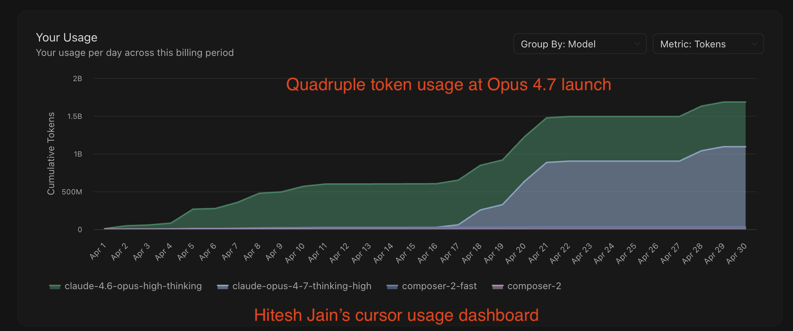

# claude-code-token-xray

[](https://github.com/Coral-Bricks-AI/coral-ai)
[](../LICENSE)


Reverse-engineer a month of your own local Claude Code logs
(`~/.claude/projects/*/*.jsonl`) into where the **tokens, time, and cost**
actually go — and run it on yours. Reads **only local logs**; nothing is sent anywhere.



> **What it found** (one month of my own logs — 181 sessions, 25,564 model calls):
>
> - **You don't pay to generate, you pay to re-read.** ~29M unique tokens →
>   **4.35B billed (~150×)**, because every turn re-sends the whole ~173K-token context.
> - The bill is **84% input / 16% output** — and re-reading the same context is **64%** of it.
> - The biggest line is the one you never see: **hidden reasoning** is 84% of output
>   *and* ~60% of everything re-read.
> - **~$3,371** for the month at Opus 4.7 list rates. Caching already serves 98% of
>   input — and re-reading is *still* 64% of the bill.
>
> Full write-up (all the tables, the why, the main-thread-vs-subagent split) →
> **[coralbricks.ai/blog/claude-code-token-xray](https://coralbricks.ai/blog/claude-code-token-xray)**

## Quickstart

```bash
pip install -r requirements.txt   # just tiktoken
python3 token_time_breakdown.py
python3 cost.py
python3 main_vs_sidecar.py
python3 reread_breakdown.py
```

> tiktoken is OpenAI's tokenizer, not Claude's, so token *proportions* are
> reliable to ~±15%, not Claude-exact. The billed-token counts in `cost.py` come
> straight from the API `usage` blocks and are exact.

## What a month cost

From `cost.py` on my logs, priced at Opus 4.7 list rates:

| Line item | Cost | Share |
|---|--:|--:|
| Input — re-reading context (cache reads) | $2,176 | 64% |
| Input — cache writes | $682 | 20% |
| Input — fresh (uncached) | $2 | 0% |
| Output — reasoning | $429 | 13% |
| Output — tool calls + summaries | $82 | 2% |
| **Total** | **$3,371** | **100%** |

Caching is the only thing keeping it sane — without it the same work lists at
**~$22,630** (~7×). Your numbers will differ; that's the point. Run it on yours.

## Scripts

- **`token_time_breakdown.py`** — the headline table: tokens (marked input/output)
  **and** wall-clock time per activity (reasoning, running commands, writing tool
  calls, subagents, summaries, reading/searching, editing) plus the
  passive-context rows (system prompt + tools, attachments, the typed prompt,
  injected reminders). One pass, so tokens and time stay consistent. Reasoning
  isn't stored in plaintext (only an encrypted signature), so it's recovered by
  subtraction: `output − tool_calls − summaries`. Time is reconstructed from
  event timestamps.
- **`cost.py`** — billed token totals (cache reads / cache writes by TTL / fresh
  input / output) priced at Opus 4.7 list rates, plus the no-caching
  counterfactual.
- **`main_vs_sidecar.py`** — splits the human-driven main thread from spawned
  subagents (logged under nested `*/subagents/*.jsonl`); reports billed tokens,
  per-model mix, cache-hit rate, turns per agent (per session for the main
  thread, per subagent for the sidecar), and cost for each, plus the combined
  total.
- **`reread_breakdown.py`** — per-activity *cumulative* input: replays each
  session's context growth to show what each kind of context costs once it's
  re-read every turn. Reports `unique` vs `re-read` tokens per activity (reasoning
  is the biggest re-read line). The replay is scaled to the measured billed input
  (exact); the per-activity split is a model.
- **`backup_sessions.py`** — incremental backup of session JSONLs to S3 (uses
  `aws s3 sync --size-only`, so only new/grown files transfer). Same bucket can
  hold sessions from many people and/or headless agent boxes — each at their own
  top-level prefix (`alice/local/`, `bob/local/`, `cb_architect/`, ...). Config
  is a small JSON file (`backup_config.example.json` is a template); the script
  itself ships no deployment-specific values. First run creates the bucket and,
  if remote hosts are configured, attaches a policy so each remote's instance
  role can write to its own prefix via SSM-triggered `aws s3 sync`. Useful if
  you want a daily off-machine archive of your session history beyond Claude
  Code's local `cleanupPeriodDays` window.

## Caveats

- One person's month on one machine — directional, not a benchmark. Claude Code
  is dynamic, so your split will differ. That's the point: run it on yours.
- A generation-time gap also includes the model reading its context before it
  writes; Bash time is real execution (commands auto-approved), but code run in
  the background or a separate terminal isn't counted.
- The system-prompt row is estimated from each session's first cache write.

## Found this useful?

If this helped you see where your Claude Code tokens, time, and cost actually go,
please ⭐ [the repo](https://github.com/Coral-Bricks-AI/coral-ai) — it helps others
find it. Curious what your re-read share comes out to.

## License

Apache 2.0 — see the repository [LICENSE](../LICENSE).
