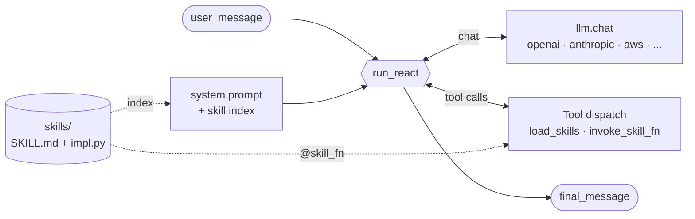

# harness

**Build agents that run on your laptop, with skills you write and own.**

Clone the repo, install one package, set your provider key, and ask a question:

```bash
git clone https://github.com/Coral-Bricks-AI/coral-ai.git
cd coral-ai && pip install -e .
export LLM_API_KEY=sk-...

python harness/examples/cocktails/ask.py "What's in a Negroni and how strong is it?"
```

The runner under the hood:

```python
from harness.react import run_react
from harness.skills_loader import load_skills, render_index, render_loaded
from harness.skill_tools import INVOKE_SKILL_FN, make_load_skill_tool

SKILLS = load_skills("./skills")  # discovers SKILL.md + impl.py folders
LOAD_SKILL = make_load_skill_tool(
    lambda ids: render_loaded(list(ids), skills=SKILLS),
)

prompt = f"You are a bartender.\n\n## Skills\n{render_index(SKILLS)}"

traj = run_react(
    model="openai/gpt-4o-mini",
    system_prompt=prompt,
    user_message="What's in a Negroni and how strong is it?",
    tools=[LOAD_SKILL, INVOKE_SKILL_FN],
)
print(traj.final_message["content"])
```

The same code runs against OpenAI, Anthropic, Bedrock, or any OpenAI-compatible proxy — change one prefix on the model string.

---

## What this is

An agent harness composed of three primitives:

- **Skills** — the unit of reusable domain competence. Each skill is a markdown playbook the model loads on demand, plus zero-or-more `@skill_fn`-decorated Python callables it dispatches to. One decorator binds prompt instructions, JSON Schema, and the Python function at import time. Skills are hard rules, not many-shot examples — examples teach the model to pattern-match; hard rules generalize.
- **Agent types** — each agent runs a ReAct loop over its own tool roster and skills index. Hello-world uses one specialist. Larger instances split into a **planner** (decomposes, dispatches in parallel, prunes, converges) and **specialists** (each a persona prompt + a scoped skills index). One agent with 70 skills picks worse than five agents with 10–15 each — more candidate tools means more routing collisions.
- **Runtime constraints** — declarative, decorator-driven guarantees the runtime enforces on every tool call. `@time_bounded` clamps an "as of" cutoff into time-sensitive retrieval. `min_tool_calls_before_final` refuses a no-tool answer from a persona whose contract requires retrieval first — the differentiator vs vanilla ReAct.

We extended this harness to build [AlphaCumen](../alphacumen), a finance agent harness that scores **82.6% on Vals AI Finance Agent v2** — a 38-point gain over a vanilla harness on the same model, at $0.13/query.

The runtime is ~1,900 lines of Python with no agent-framework dependency. Provider-neutral: OpenAI, Anthropic, Bedrock, plus OpenAI-compatible proxies (Together, OpenRouter, Cerebras, DeepInfra, Lilac). Apache 2.0. Standalone — zero `alphacumen` imports — so you can vendor just `harness/` into your own repo.

The long-form design rationale is in the blog post: [Write Your Own Agent Harness](https://coralbricks.ai/blog/write-your-own-harness) — one section per primitive.

### Module map

| File | Role |
|---|---|
| `react.py` | The ReAct loop — `run_react`, `chat_with_retry`, per-model watchdog + provider fallback, `Trajectory`/`Step` recording |
| `llm.py` | Direct-provider chat client. Dispatch by model prefix (`openai/`, `anthropic/`, `aws/`, plus OpenAI-compatible proxies: `lilac/`, `together/`, `openrouter/`, `cerebras/`, `deepinfra/`) |
| `skill_fn.py` | The `@skill_fn` decorator — register a Python callable against a skill id and a JSON Schema |
| `skills_loader.py` | Folder loader. `<slug>.md` (prose-only) and `<slug>/SKILL.md` + `impl.py` (folder-shaped with bound Python) |
| `skill_tools.py` | Model-facing dispatch tools (`INVOKE_SKILL_FN`, `make_load_skill_tool`) |
| `tool.py` | The `Tool` dataclass + OpenAI tool-schema serialization |
| `constraints.py` | `HarnessConstraints` dataclass (asof / tool_budget / max_rounds / allowed_indices / token_budget) |
| `decorators.py` | The `@time_bounded` declarative tool contract |
| `enforcement.py` | `LocalEnforcer` reads declarations, runs `before_tool_call` / `after_tool_call` around every dispatch |
| `context.py` | Per-run context propagation (ContextVar-based) |
| `stubs/` | Stubs for retrieval verbs (BM25 / ANN / SQL / multihop / get / py) and the Python executor. Replace with your own backends. |

---

## Create your own harness

The fastest path: copy `examples/cocktails/`, rewrite four pieces. The whole new harness is usually < 100 lines plus your skills.

### 1. Pick a persona + corpus

Decide what your specialist knows. The bartender knows 20 cocktails. Yours might be a tax analyst over IRS publications, a code reviewer over your repo, a medic over treatment protocols, an SRE over runbooks. The corpus can be a JSON file, a SQLite DB, a directory of markdown, or a remote API — the skills decide.

### 2. Write each skill as a folder

A skill is `<slug>/SKILL.md` (the routing playbook the model reads) + `<slug>/impl.py` (the Python the runtime dispatches to). They share a slug.

```
skills/
└── my_skill/
    ├── SKILL.md
    └── impl.py
```

`SKILL.md`:

```markdown
---
id: my_skill
when: One-line trigger telling the model when to use this skill.
applies_to: [my_specialist]
---

Call `my_skill(query=<free text>)`. Returns `{"results": [...]}`.

Use this BEFORE <other skill> when the user asks about <X>.
```

`impl.py`:

```python
from harness.skill_fn import skill_fn

@skill_fn(
    skill_id="my_skill",
    description="One-line description the model sees in the dispatch schema.",
    parameters={
        "type": "object",
        "properties": {"query": {"type": "string"}},
        "required": ["query"],
    },
)
def my_skill(*, query: str):
    return {"results": [...]}
```

### 3. Write the persona prompt

A markdown file with a `{skill_index}` placeholder. Keep it short — the model reads it on every turn.

```markdown
You are **<role>**, a <one-line identity>. You answer <domain>
questions accurately, quoting source data faithfully.

## Skill index

{skill_index}

## How to use skills

1. Call `load_skill(skill_ids=[...])` to pull a skill's body.
2. Call `invoke_skill_fn(skill_id=..., fn=..., args={...})` to dispatch.
3. Emit your final answer with no further tool calls when done.

## Style

- Faithful to the source data. Don't invent.
- Tight answers — one short paragraph unless the question demands more.
```

### 4. Wire it up — the 20-line runner

```python
from harness.react import run_react
from harness.skills_loader import load_skills, render_index, render_loaded
from harness.skill_tools import INVOKE_SKILL_FN, make_load_skill_tool

SKILLS = load_skills("./skills")
LOAD_SKILL = make_load_skill_tool(
    lambda ids: render_loaded(list(ids), skills=SKILLS),
)

PROMPT = open("persona.md").read().replace("{skill_index}", render_index(SKILLS))

def ask(question, model="openai/gpt-4o-mini"):
    traj = run_react(
        model=model,
        system_prompt=PROMPT,
        user_message=question,
        tools=[LOAD_SKILL, INVOKE_SKILL_FN],
        max_steps=6,
    )
    return traj.final_message["content"]
```

Run it. Add more skills. Swap the model with one env-var change.

### Tips from building real harnesses

- **Iterate on `SKILL.md` before `impl.py`.** The playbook is what shapes model behavior; the implementation is just a function. Get the routing right first.
- **Keep `when:` short.** It renders into the index on every prompt — wasted tokens at scale. One sentence, written in the language the user uses.
- **Prefer narrow, composable skills over kitchen-sink ones.** `search_filings` + `extract_kpi` beats one `analyze_company`. The model is good at chaining; let it.
- **Test without an API key.** You can dispatch tools directly: `LOAD_SKILL.fn(["my_skill"])` returns the rendered block, `INVOKE_SKILL_FN.fn("my_skill", "my_skill", {"query": "..."})` runs your impl. Catch shape bugs before paying for tokens.
- **`applies_to` in the SKILL.md frontmatter** is informational metadata, not enforced by the loader. When you grow to many specialists, filter on it yourself before calling `render_index` so each persona sees only its own skills.

---

## Example harness

`examples/cocktails/` is the worked hello-world. One specialist (a bartender), two skills (BM25 search + ABV math), 20 cocktails of data, ~50 lines of glue. You ran it in the hero block above — here's what it answers and what's inside.

```
Q: What's in a Negroni and how strong is it?

A: A Negroni is 30 ml gin, 30 ml sweet vermouth, and 30 ml Campari, stirred
   over ice and served in a rocks glass with an orange peel. It comes out
   to roughly 27% ABV — a strong, bitter aperitivo.
```

More sample queries:

```bash
python harness/examples/cocktails/ask.py "Find me a refreshing rum cocktail without mint"
python harness/examples/cocktails/ask.py "Which classic gin cocktails are stirred?"
python harness/examples/cocktails/ask.py "How strong is an Espresso Martini?"
```

### What's on disk

```
examples/cocktails/
├── ask.py                     # 50-line runner — calls run_react()
├── bartender.md               # the system prompt (with {skill_index} placeholder)
├── data/cocktails.json        # the corpus (20 cocktails)
└── skills/
    ├── search_cocktails/
    │   ├── SKILL.md           # routing playbook the model reads
    │   └── impl.py            # @skill_fn-decorated Python the runtime calls
    └── compute_alcohol_content/
        ├── SKILL.md
        └── impl.py
```

### One skill, end to end

Two files, sharing a slug. Markdown for the model, Python for the runtime.

`skills/search_cocktails/SKILL.md`:

```markdown
---
id: search_cocktails
when: Find cocktails by name, ingredient, style, or tag. Use FIRST when the user
      names a cocktail or describes a style.
applies_to: [bartender]
---

Call `search_cocktails(query=<free text>, k=<int, default 5>)`.

Returns a ranked list of `{"id", "name", "tags", "ingredient_names"}`.
After search, if the question is quantitative, follow up with
`compute_alcohol_content` using the top result's `id`.
```

`skills/search_cocktails/impl.py`:

```python
from harness.skill_fn import skill_fn

@skill_fn(
    skill_id="search_cocktails",
    description="Rank cocktails by BM25 over name + tags + ingredient names.",
    parameters={
        "type": "object",
        "properties": {
            "query": {"type": "string"},
            "k": {"type": "integer", "default": 5},
        },
        "required": ["query"],
    },
)
def search_cocktails(*, query: str, k: int = 5):
    ...  # BM25 over the corpus
    return {"query": query, "results": results}
```

The decorator registers the callable in a process-global registry at import time. The model dispatches by id — `invoke_skill_fn(skill_id="search_cocktails", fn="search_cocktails", args={...})` — and the runtime runs your Python.

### Skills load lazily

The model sees only a one-line *index* of every skill in its system prompt:

```
- search_cocktails  — Find cocktails by name, ingredient, style, or tag. Use FIRST...
- compute_alcohol_content — Volume-weighted ABV across a cocktail's ingredients.
```

To use one, it calls `load_skill(skill_ids=["search_cocktails"])` and the body of `SKILL.md` plus the JSON Schema for `invoke_skill_fn` get spliced into the thread. Seventy skills indexed cost ~70 lines of context; only the loaded bodies pay tokens.

---

## Architecture

How the primitives wire together at runtime:



Three loops of data flow:

1. The **skill index** is rendered into the system prompt once at startup.
2. The **ReAct loop** alternates between `llm.chat` and tool dispatch until the model emits an answer with no tool calls.
3. Each **tool dispatch** either pulls a skill body in (`load_skills`) or runs a registered `@skill_fn` callable (`invoke_skill_fn`).

That's the whole picture — no graph, no agent class, no orchestrator.

---

## FAQ

**Is this production ready?**
Yes. We built [AlphaCumen](../alphacumen) on this harness and it beat every public finance benchmark we ran (FinanceBench, ValsAI). The same `run_react` loop, the same `@skill_fn` dispatch, the same `llm.chat` provider client you see in the cocktails example are the ones that drove those runs — at seven specialists, sixty-nine skills, and tens of thousands of evaluations. If it can hold up there, it can hold up under your workload.

**How does this compare to LangChain / LangGraph / CrewAI / AutoGen?**
Those are frameworks: they own the loop, the abstractions, and the lifecycle. You learn their objects (chains, runnables, agents, crews, graphs) before you can ship anything. The harness is the opposite — it owns nothing you can't read in one sitting. The whole ReAct loop is one function. Skills are folders. Tools are dataclasses. If you want a framework's ergonomics, take a framework; if you want the dispatch contract and nothing else, take this.

**Why "skills" instead of "tools"?**
A tool is one callable. A skill is a unit of *reusable competence* — a markdown playbook the model reads (when to use it, what the I/O contract is, how to chain it) plus zero-or-more Python callables it can dispatch to. The split is what makes lazy loading work: 70 skills cost ~70 lines of context in the index; only the loaded bodies pay tokens.

**How do I scale past one specialist?**
[`alphacumen/`](../alphacumen) is the reference instance: seven specialists, sixty-nine skills, a planner that dispatches in parallel, a synthesizer that writes the final structured envelope, and `HarnessConstraints` for run-level invariants (asof / tool budgets / index allowlist) enforced across dispatches. Same primitives, larger composition. When one specialist isn't enough, read it as the template.

**Can I use my own LLM provider?**
Yes. `llm.chat` dispatches by the model-string prefix: `openai/`, `anthropic/`, `aws/` (Bedrock), plus OpenAI-compatible proxies (`together/`, `openrouter/`, `cerebras/`, `deepinfra/`, `lilac/`). If your provider speaks the OpenAI chat-completions shape, add it in a dozen lines. If it doesn't, fork `_chat_anthropic` as a template.

**Can I bring my own retrieval backend?**
Yes. `harness/stubs/tools.py` is where the kernel verbs (`bm25`, `ann`, `sql`, `multihop`, `get`, `py`) live as stubs. Replace them with your own backend (OpenSearch, Pinecone, DuckDB, whatever) and the rest of the harness keeps working. Skills don't know what's behind the verb — they just call it.

**Does it persist sessions / memory across runs?**
Not in this build. The `Trajectory` is a per-run record; persistence is a layer you wire on top.

**What's the dependency footprint?**
The framework itself is `openai`, `anthropic`, optional `boto3` (Bedrock), and stdlib. No LangChain. No LangGraph. No vector DB. Skills can pull in whatever they want at the `impl.py` layer.

---

Apache 2.0 — see [LICENSE](../LICENSE).
