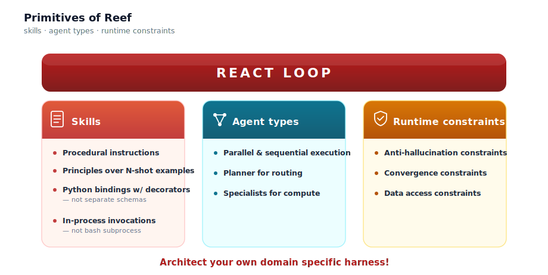
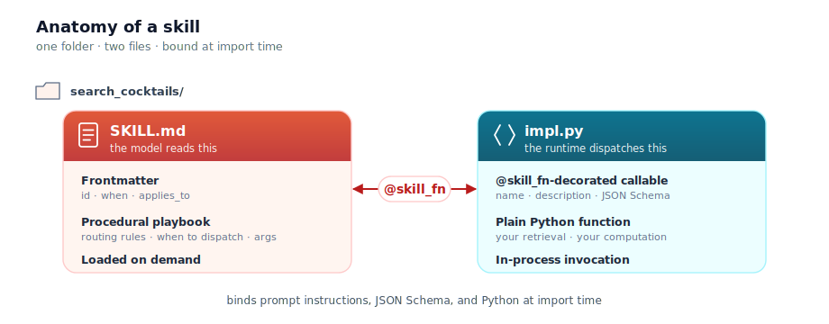
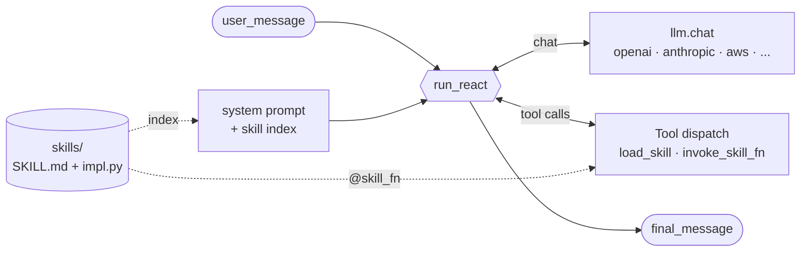

# Reef

**Build agent harnesses for domains with dozens of conditional rules.**

> [AlphaCumen](../alphacumen) — a finance agent harness built on Reef — scores **82.6%** on Vals AI Finance Agent v2 (+24.7pp over the top generic-harness frontier model), **90%** on Vals AI v1.1, and **89.3%** on Patronus FinanceBench at **$0.13 / query**.

[](../LICENSE)
[](#)
[](https://github.com/Coral-Bricks-AI/coral-ai)
[](https://coralbricks.ai/blog/write-a-winning-agent-harness)

<p align="center">
  
</p>

---

## Quickstart

Clone, install, set your LLM provider key, ask a question:

```bash
git clone https://github.com/Coral-Bricks-AI/coral-ai.git
cd coral-ai && pip install -e .
export LLM_API_KEY=sk-...

python reef/examples/cocktails/ask.py "What's in a Negroni and how strong is it?"
```

```
Q: What's in a Negroni and how strong is it?

A: A Negroni is 30 ml gin, 30 ml sweet vermouth, and 30 ml Campari, stirred
   over ice and served in a rocks glass with an orange peel. It comes out
   to roughly 27% ABV — a strong, bitter aperitivo.
```

See [`reef/examples/cocktails/`](examples/cocktails) for the worked walkthrough.

---

## What you get

Reef is an agent harness for domains with dozens of conditional rules — financial conventions, treatment protocols, tax edge cases. Markdown + Python folders versioned in git beat prompt templates and custom DSLs here: editable by domain experts, lazy-loaded into context, each skill a typed dispatch contract.

- **Skills as folders.** `SKILL.md` (procedural playbook the model loads on demand) + `impl.py` (`@skill_fn`-decorated Python the runtime dispatches to). One decorator binds prompt instructions, JSON Schema, and the function at import time.
- **Lazy skill loading.** The model sees a one-line index of every skill in its system prompt; bodies load on `load_skill(skill_ids=[…])`. Seventy skills cost ~70 lines of context until used.
- **One ReAct loop, ~1,900 LOC.** `run_react()` does retry, watchdog timeouts, provider fallback, structured trajectory recording, and tool-error-as-message serialization. Read it in one sitting.
- **Declarative runtime constraints.** `@time_bounded` clamps an "as of" cutoff into time-sensitive retrieval. `min_tool_calls_before_final` refuses a no-tool answer from a persona whose contract requires retrieval first. Tool / token / round budgets enforced inline.
- **Provider-neutral.** OpenAI, Anthropic, Bedrock, plus OpenAI-compatible proxies (Together, OpenRouter, Cerebras, DeepInfra, Lilac). `<provider>/<model>` prefix on the model string; one `LLM_API_KEY` covers the common case.
- **Standalone.** Zero finance imports — Reef is a domain-agnostic library you can vendor on its own.
- **Apache 2.0.** Fork it, vendor it, rip pieces out.

The long-form design rationale is in the blog post: [Write Your Own Agent Harness](https://coralbricks.ai/blog/write-a-winning-agent-harness) — one section per primitive.

---

## Create your own harness

The fastest path: copy [`reef/examples/cocktails/`](examples/cocktails) and rewrite four pieces. The whole new harness is usually < 100 lines plus your skills.

### 1. Pick a persona + corpus

Decide what your specialist knows. The bartender knows 20 cocktails. Yours might be a tax analyst over IRS publications, a code reviewer over your repo, a medic over treatment protocols, an SRE over runbooks. The corpus can be a JSON file, a SQLite DB, a directory of markdown, or a remote API — the skills decide.

### 2. Write each skill as a folder

A skill is `<slug>/SKILL.md` (the routing playbook the model reads) + `<slug>/impl.py` (the Python the runtime dispatches to). They share a slug.

<p align="center">
  
</p>

```
skills/
└── my_skill/
    ├── SKILL.md
    └── impl.py
```

`SKILL.md`:

```markdown
---
id: my_skill
when: One-line trigger telling the model when to use this skill.
applies_to: [my_specialist]
---

Call `my_skill(query=<free text>)`. Returns `{"results": [...]}`.

Use this BEFORE <other skill> when the user asks about <X>.
```

`impl.py`:

```python
from reef.skill_fn import skill_fn

@skill_fn(
    skill_id="my_skill",
    description="One-line description the model sees in the dispatch schema.",
    parameters={
        "type": "object",
        "properties": {"query": {"type": "string"}},
        "required": ["query"],
    },
)
def my_skill(*, query: str):
    return {"results": [...]}
```

### 3. Write the persona prompt

A markdown file with a `{skill_index}` placeholder. Keep it short — the model reads it on every turn.

```markdown
You are **<role>**, a <one-line identity>. You answer <domain>
questions accurately, quoting source data faithfully.

## Skill index

{skill_index}

## How to use skills

1. Call `load_skill(skill_ids=[...])` to pull a skill's body.
2. Call `invoke_skill_fn(skill_id=..., fn=..., args={...})` to dispatch.
3. Emit your final answer with no further tool calls when done.

## Style

- Faithful to the source data. Don't invent.
- Tight answers — one short paragraph unless the question demands more.
```

### 4. Wire it up

```python
from reef.react import run_react
from reef.skills_loader import load_skills, render_index, render_loaded
from reef.skill_tools import INVOKE_SKILL_FN, make_load_skill_tool

# load your skills from your skills folder
SKILLS = load_skills("./skills")
# Wraps your skills into an LLM tool. The model passes skill_ids
# at call time; the runtime looks them up in the SKILLS registry and
# returns the rendered bodies into the model's thread for the rest of the run.
LOAD_SKILL = make_load_skill_tool(
    lambda ids: render_loaded(list(ids), skills=SKILLS),
)

PROMPT = open("persona.md").read().replace("{skill_index}", render_index(SKILLS))

def ask(question, model="openai/gpt-4o-mini"):
    traj = run_react(
        model=model,
        system_prompt=PROMPT,
        user_message=question,
        tools=[LOAD_SKILL, INVOKE_SKILL_FN],
        max_steps=6,
    )
    return traj.final_message["content"]
```

Run it. Add more skills. Swap the model with one env-var change.

### Tips

- **Iterate on `SKILL.md` before `impl.py`.** The playbook is what shapes model behavior; the implementation is just a function. Get the routing right first.
- **Keep `when:` short.** It renders into the index on every prompt — wasted tokens at scale. One sentence, written in the language the user uses.
- **Prefer narrow, composable skills over kitchen-sink ones.** `search_filings` + `extract_kpi` beats one `analyze_company`. The model is good at chaining; let it.
- **Test without an API key.** Dispatch tools directly: `LOAD_SKILL.fn(["my_skill"])` returns the rendered block, `INVOKE_SKILL_FN.fn("my_skill", "my_skill", {"query": "..."})` runs your impl. Catch shape bugs before paying for tokens.
- **`applies_to` is informational metadata**, not enforced by the loader. When you grow to many specialists, filter on it yourself before calling `render_index` so each persona sees only its own skills.

---

## Architecture

How the primitives wire together at runtime:



Three loops of data flow:

1. The **skill index** is rendered into the system prompt once at startup.
2. The **ReAct loop** alternates between `llm.chat` and tool dispatch until the model emits an answer with no tool calls.
3. Each **tool dispatch** either pulls a skill body in (`load_skill`) or runs a registered `@skill_fn` callable (`invoke_skill_fn`).

That's the whole picture — no graph, no agent class, no orchestrator.

---

## FAQ

**Is this production ready?**
Yes. [AlphaCumen](../alphacumen) — built on Reef — scores **82.6%** on Vals AI Finance Agent v2 (+24.7pp over the top generic-harness frontier model), **90%** on Vals AI v1.1, and **89.3%** on Patronus FinanceBench at **$0.13/query**. Seven specialists, sixty-nine skills, tens of thousands of evaluations. The same `run_react` loop, `@skill_fn` dispatch, and `llm.chat` client you see in the cocktails example drove those runs.

**When should I use Reef?**
When your domain has dozens of conditional rules (financial conventions, treatment protocols, tax edge cases, compliance carve-outs) you want versioned, diff-able, and editable by people who don't live in framework code. When your agent makes multi-step retrieval + computation calls and you want each step to be a typed dispatch with its own playbook. When you want one ReAct loop you can read end-to-end.

**When should I NOT use Reef?**
When your app is a single-prompt LLM call — pick the provider SDK directly. When you're building a conversational chat agent and don't need declarative dispatch. When you need stateful, resumable workflows with checkpointing and human-in-the-loop pause/resume — pick a graph-based agent runtime. When you need a hundred SaaS integrations out of the box — pick a framework with a big adapter catalog.

**Can I use my own LLM provider?**
Yes. `reef.llm.chat` dispatches by the model-string prefix: `openai/`, `anthropic/`, `aws/` (Bedrock), plus OpenAI-compatible proxies (`together/`, `openrouter/`, `cerebras/`, `deepinfra/`, `lilac/`). If your provider speaks the OpenAI chat-completions shape, add it in a dozen lines.

**Can I bring my own retrieval backend?**
Yes. `reef/stubs/tools.py` is where the kernel verbs (`bm25`, `ann`, `sql`, `multihop`, `get`, `py`) live as stubs. Replace them with your own backend (OpenSearch, Pinecone, DuckDB, whatever) and the rest of Reef keeps working. Skills don't know what's behind the verb — they just call it.

**Does it persist sessions / memory across runs?**
Not in this build. The `Trajectory` is a per-run record; persistence is a layer you wire on top.

**What's the dependency footprint?**
`openai`, `anthropic`, optional `boto3` (Bedrock), and stdlib. No LangChain. No LangGraph. No vector DB. Skills pull in whatever they need at the `impl.py` layer.

---

Apache 2.0 — see [LICENSE](../LICENSE).
